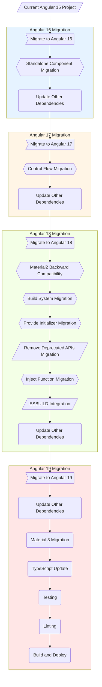

# 🌀 <span style="color:red">Migrating an Angular 15 project to Angular 19.1 with Material 3</span>

<div
  style="
  display: flex;
  flex-direction: column;
  justify-content: stretch;
  align-items: cetner;
  gap: 20px;
">

<div>
<br/>
<div
  style="width: 100%; display: inline-flex; flex-direction: row; flex-wrap: wrap; justify-content: space-around; align-items: center; gap: 50px;">
&nbsp;
  
&nbsp;
  
&nbsp;
  
&nbsp;
  
&nbsp;
</div>

## ⚡ Table of Contents

- [🌀 Migrating an Angular 15 project to Angular 19.1 with Material 3](#-migrating-an-angular-15-project-to-angular-191-with-material-3)
  - [⚡ Table of Contents](#-table-of-contents)
  - [✨ Final Project's Material 3 Various Patteletes Preview](#-final-projects-material-3-various-patteletes-preview)
  - [📝 Abstract](#-abstract)
  - [🎯 Overview: Quick overview of all commit of Migration](#-overview-quick-overview-of-all-commit-of-migration)
  - [🎯 Introduction](#-introduction)
  - [❗**About Angular Migration**](#about-angular-migration)
    - [🗒️ Notes](#️-notes)
    - [⚛️ Standard Commands for Angular Update](#️-standard-commands-for-angular-update)
  - [🚀 **Part 1: Migrate to Angular 19 with Incremental Updates: A Comprehensive Guide**](#-part-1-migrate-to-angular-19-with-incremental-updates-a-comprehensive-guide)
    - [1️⃣ **Upgrade to Angular 16**](#1️⃣-upgrade-to-angular-16)
      - [**1. Update Angular Packages**](#1-update-angular-packages)
      - [**2. Migrate to Standalone Components (Optional but highly recommended)**](#2-migrate-to-standalone-components-optional-but-highly-recommended)
      - [**3. Update Other Dependencies**](#3-update-other-dependencies)
    - [2️⃣ **Upgrade to Angular 17**](#2️⃣-upgrade-to-angular-17)
      - [**1. Update Angular 17 Packages**](#1-update-angular-17-packages)
      - [**2.Migrate to Control Flow Statements**](#2migrate-to-control-flow-statements)
      - [**3. Update Other Dependencies in compatibility with Angular 18**](#3-update-other-dependencies-in-compatibility-with-angular-18)
    - [3️⃣ **Upgrade to Angular 18**](#3️⃣-upgrade-to-angular-18)
      - [**1. Update Angular 18 Packages**](#1-update-angular-18-packages)
        - [**Other Various Migrations in Angular 18:**](#other-various-migrations-in-angular-18)
      - [**2. Update Other Dependencies in compatibility with Angular 18**](#2-update-other-dependencies-in-compatibility-with-angular-18)
    - [3. **Upgrade to Angular 19**](#3-upgrade-to-angular-19)
      - [**1. Update Angular 19 Packages**](#1-update-angular-19-packages)
      - [**2. Update Other Dependencies in compatibility with Angular 19**](#2-update-other-dependencies-in-compatibility-with-angular-19)
    - [Conclusion](#conclusion)
  - [🚀 **Part 2:** Migrate to Material 3 in Angular: A Comprehensive Guide](#-part-2-migrate-to-material-3-in-angular-a-comprehensive-guide)
    - [🔄 Background](#-background)
    - [📄 Abstract](#-abstract-1)
    - [📝 Introduction to Material 3](#-introduction-to-material-3)
    - [🔑 Key Differences Between Material 2 and Material 3 Theming](#-key-differences-between-material-2-and-material-3-theming)
    - [🧩 Understanding Material 3's CSS Variables](#-understanding-material-3s-css-variables)
    - [🔄 The Quick Migration Process: Two Key Steps (Without learning)](#-the-quick-migration-process-two-key-steps-without-learning)
      - [Step 1: Define Color Palettes by existing theme's color patteletes](#step-1-define-color-palettes-by-existing-themes-color-patteletes)
      - [Step 2: Override CSS Variables](#step-2-override-css-variables)
    - [🛠️ Steps to Migrating Custom Themes in Material 3 (Detailed with optional steps required for full project migrations)](#️-steps-to-migrating-custom-themes-in-material-3-detailed-with-optional-steps-required-for-full-project-migrations)
    - [🏁 Conclusion](#-conclusion)
  - [📊 Visual Overview](#-visual-overview)
    - [📈 Migration Process Flowchart For Angular 15 -\> Angular 19 and Material 3](#-migration-process-flowchart-for-angular-15---angular-19-and-material-3)
  - [📖 Summary](#-summary)
  - [🏁 Conclusions](#-conclusions)

## ✨ Final Project's Material 3 Various Patteletes Preview

<div style="display:flex; flex-direction: row; justify-content: space-around; flex-wrap: wrap; align-items: stretch;>
  
  
  
  
  </div>
  <div style="display:flex; flex-direction: row; justify-content: space-around; flex-wrap: wrap; align-items: stretch;>
  
  
  
  
</div>

## 📝 Abstract

<p style="margin-left: 20px;">This guide provides a structured approach to migrating to latest **Material 3**. In order to use Material 3, we need to upgrade our Angular project to >= Angular 18, as Material 3 was not quite compatible with Angular 17 or below.</p>

## 🎯 Overview: Quick overview of all commit of Migration

> (All steps and details after this section)

**Here is a quick overview summary of the migration process' commits:**

> ⚒️ [Main Link of Source Code - All commits - https://github.com/spica234/angular-update-with-material3-poc/commits/main/](https://github.com/spica234/angular-update-with-material3-poc/commits/main/)

|     | **Title**                                                            | **Description**                                                                                                                                                                                                                                                                                                               | **Link**                                                                                                                                                                                                                                                                                                                                                                                                                                                                                                                                                                                                                                                                                                                                                                                                                                                                                                                                                                                                                                                                                                                                                                                                                                                                                                                                                                                                   |
| --- | -------------------------------------------------------------------- | ----------------------------------------------------------------------------------------------------------------------------------------------------------------------------------------------------------------------------------------------------------------------------------------------------------------------------- | ---------------------------------------------------------------------------------------------------------------------------------------------------------------------------------------------------------------------------------------------------------------------------------------------------------------------------------------------------------------------------------------------------------------------------------------------------------------------------------------------------------------------------------------------------------------------------------------------------------------------------------------------------------------------------------------------------------------------------------------------------------------------------------------------------------------------------------------------------------------------------------------------------------------------------------------------------------------------------------------------------------------------------------------------------------------------------------------------------------------------------------------------------------------------------------------------------------------------------------------------------------------------------------------------------------------------------------------------------------------------------------------------------------- |
| 1.  | **Create New Project For POC**                                       | Created a `new project with minimal code`</br> - `HomePage` has all list of `users`, shown as `cards` </br> - Clicking on button `More Info`, open a `Model/Dialong` with entire `user detail` </br> -Project has that's all functionalities </br>- Created a `Core-Card` core component, an API Service, Loader Service etc. | - [x] [Angular 15 Project](https://github.com/spica234/angular-update-with-material3-poc/commit/0bdb9091a431ebd7386bb6657d50a3d82b5864bc) </br> - [x] [Create bareminimum project](https://github.com/spica234/angular-update-with-material3-poc/commit/d217ea4442aa7271ee11bb9eb754c5c24fc32a1e) </br> - [x] [Add ESLINT](https://github.com/spica234/angular-update-with-material3-poc/commit/afcebe262cc21342f74ec36844863ca0cb8186e9) </br> - [x] [Add Angular Material to Project](https://github.com/spica234/angular-update-with-material3-poc/commit/afcebe262cc21342f74ec36844863ca0cb8186e9) </br> - [x] [Remove Duplicate](https://github.com/spica234/angular-update-with-material3-poc/commit/f4d5652b12c56e1669f51fa8cc5e763d6f858dd8) </br>  - [x] [Write all necessory codes related to project's POC requirement](https://github.com/spica234/angular-update-with-material3-poc/commit/2693af0175e46381a582c7da2a0c5b6d34f14542) </br> - [x] [Create A task for debug](https://github.com/spica234/angular-update-with-material3-poc/commit/84b57322e3819e3fa9d39f2f9cc9c0f3c53310ee) </br> - [x] [Add initial styles](https://github.com/spica234/angular-update-with-material3-poc/commit/f8b0ca7e245f3e2270f7098c90b80407ce16b464) </br> - [x] [Add a missing fav icon](https://github.com/spica234/angular-update-with-material3-poc/commit/5a7d472ef0bb2ec170c327c4df90b3b0a590523d) |
| 2.  | **Migrate to Angular 16**                                            | Migrated the project to `Angular 16`</br> - Updated `Angular` and `Angular Material` to version `16`</br> - Addressed any `deprecations` or `breaking changes`                                                                                                                                                                | - [x] [Migrate to Angular 16](https://github.com/spica234/angular-update-with-material3-poc/commit/5696f5b497e88759bf939497ddb928c9c400bcf3) </br> - [x] [Update Other Dependencies](https://github.com/spica234/angular-update-with-material3-poc/commit/a24ddcc817a2bcfafa17feb568c87d063cd8e71a)                                                                                                                                                                                                                                                                                                                                                                                                                                                                                                                                                                                                                                                                                                                                                                                                                                                                                                                                                                                                                                                                                                        |
| 3.  | **Migrate to Angular 17**                                            | Migrated the project to `Angular 17`</br> - Updated `Angular` and `Angular Material` to version `17`</br> - Addressed any `deprecations` or `breaking changes`                                                                                                                                                                | - [x] [Migrate to Angular 17](https://github.com/spica234/angular-update-with-material3-poc/commit/b42b6f587b3a5254aff81a0a1068ac70605fcd67) </br> - [x] [Update Other Dependencies](https://github.com/spica234/angular-update-with-material3-poc/commit/4f0339f7055a577ca63b591d2ffbd95a0bdafc72) </br> - [x] [Migrate to Control Flow Statements](https://github.com/spica234/angular-update-with-material3-poc/commit/9dc3fba3d60d09b35737a791ea13f7089a2174ac)                                                                                                                                                                                                                                                                                                                                                                                                                                                                                                                                                                                                                                                                                                                                                                                                                                                                                                                                        |
| 4.  | **Migrate to Angular 18**                                            | Migrated the project to `Angular 18`</br> - Updated `Angular` and `Angular Material` to version `18`</br> - Addressed any `deprecations` or `breaking changes`                                                                                                                                                                | - [x] [Migrate to Angular 18](https://github.com/spica234/angular-update-with-material3-poc/commit/b7e092814c5309913ebb94c1613309071661cb06) </br> - [x] [Add backward compatibility for M2](https://github.com/spica234/angular-update-with-material3-poc/commit/7027f6a2ad764da070a31f8a60bfa684f936e90e) </br> - [x] [Remove Deprecated APIs](https://github.com/spica234/angular-update-with-material3-poc/commit/31f99ec55d3815f853cbed62e07c9765662da0a2) </br> - [x] [Update Deps](https://github.com/spica234/angular-update-with-material3-poc/commit/646bf094978d669f7606f25212bb914b0f3ac50a) </br> - [x] [Migrate to Inect fucntion](https://github.com/spica234/angular-update-with-material3-poc/commit/672bde3afe34cd3c87e3bbf09a2dc834ec86be93) </br> - [x] [Integrate ESBUILD Lazyload Migrate](https://github.com/spica234/angular-update-with-material3-poc/commit/2e40fb6fe71e90d8511fffbf94759aa4eba42272)                                                                                                                                                                                                                                                                                                                                                                                                                                                                            |
| 5.  | **Migrate to Angular 19**                                            | Migrated the project to `Angular 19`</br> - Updated `Angular` and `Angular Material` to version `19`</br> - Addressed any `deprecations` or `breaking changes`                                                                                                                                                                | - [x] [Migrate to Angular 19](https://github.com/spica234/angular-update-with-material3-poc/commit/fdf52ad9ee94339a35ee0a8555b8fdd20a09fd8f) </br> - [x] [Migrate to new APIs](https://github.com/spica234/angular-update-with-material3-poc/commit/df39c2701a9ea307f4a58f0eedbde882a385c427) </br> - [x] [Update Deps](https://github.com/spica234/angular-update-with-material3-poc/commit/9ee760760f1a92a329e62425562e068f5509f5cd) </br> - [x] [Fix Standalone rmeoved during migration](https://github.com/spica234/angular-update-with-material3-poc/commit/8bc2469a906b4297d523a555e3863c67dc089be5) </br> - [x] (Add button module)(<https://github.com/spica234/angular-update-with-material3-poc/commit/716a16c61e7b64fb491f4bd7ca2615a88ec9ea20>) </br> - [x] [Add BrowserAnimationModule](https://github.com/spica234/angular-update-with-material3-poc/commit/aa53d6a11a52cf3973010b32ac6e10bd852f40e1)                                                                                                                                                                                                                                                                                                                                                                                                                                                                                       |
| 6.  | **PreMaterial 3 Migration Build Resolutions**                        | Resolved all the build issues before migrating to Material 3                                                                                                                                                                                                                                                                  | - [x] [Resolve Build Issues](https://github.com/spica234/angular-update-with-material3-poc/commit/45433bdd2ce84752573c11d390229c1cc61dbf25)                                                                                                                                                                                                                                                                                                                                                                                                                                                                                                                                                                                                                                                                                                                                                                                                                                                                                                                                                                                                                                                                                                                                                                                                                                                                |
| 7.  | **Migrate to Material 3: Create color patteletes based on M2 Theme** | Migrated the project to `Material 3`</br> - Updated `Angular Material` to version `3`</br> - Addressed any `deprecations` or `breaking changes`                                                                                                                                                                               | - [x] [Migrate to Material 3 and make theme changes](https://github.com/spica234/angular-update-with-material3-poc/commit/aaef8e5f6b8cdbdecd1ff7e6c953615e368c88ae)                                                                                                                                                                                                                                                                                                                                                                                                                                                                                                                                                                                                                                                                                                                                                                                                                                                                                                                                                                                                                                                                                                                                                                                                                                        |
| 8.  | **Migrate to Material 3: Override Theme Colors**                     | Overrided the theme colors based on the new Material 3 theme                                                                                                                                                                                                                                                                  | - [x] [Override Theme Colors](https://github.com/spica234/angular-update-with-material3-poc/commit/4d7616c17e437fe8ec3d06e7b0587065d1ef7e82)                                                                                                                                                                                                                                                                                                                                                                                                                                                                                                                                                                                                                                                                                                                                                                                                                                                                                                                                                                                                                                                                                                                                                                                                                                                               |
| 9.  | **Migrate to Material 3: Update Typography**                         | Updated the typography based on the new Material 3 theme                                                                                                                                                                                                                                                                      | - [x] [Update Typography](https://github.com/spica234/angular-update-with-material3-poc/commit/4bcc4182768374ac6bb5d01f0fbb324ae107f3e7)                                                                                                                                                                                                                                                                                                                                                                                                                                                                                                                                                                                                                                                                                                                                                                                                                                                                                                                                                                                                                                                                                                                                                                                                                                                                   |
| 10. | **Migrate to Material 3: Update Angular.json and import new theme**  | Updated the angular.json and imported the new Material 3 theme                                                                                                                                                                                                                                                                | - [x] [Update Angular.json and import new theme](https://github.com/spica234/angular-update-with-material3-poc/commit/833c822db335e8b4d640ffaf78f1bc3e2de4b809)                                                                                                                                                                                                                                                                                                                                                                                                                                                                                                                                                                                                                                                                                                                                                                                                                                                                                                                                                                                                                                                                                                                                                                                                                                            |
| 11. | **Migrate to Material 3: Update Component Themes**                   | Updated the component themes based on the new Material 3 theme                                                                                                                                                                                                                                                                | - [x] [Update Component Themes](https://github.com/spica234/angular-update-with-material3-poc/commit/712859ef58f38ee7821be2cf849cecfa114bb674) </br> - [x] [Remove Duplicate](https://github.com/spica234/angular-update-with-material3-poc/commit/6620c0c730c3a3999e7997fbf2e08319a6d340fc) </br> - [x] [Recreate Indigo with exact color code](https://github.com/spica234/angular-update-with-material3-poc/commit/7c4883c1d02a12fbdec0e540a4e134ab1f5ade6a) </br> - [x] [Fix Import typo](https://github.com/spica234/angular-update-with-material3-poc/commit/aefb0eb116c010d6699db1535c646808d4b5012a)                                                                                                                                                                                                                                                                                                                                                                                                                                                                                                                                                                                                                                                                                                                                                                                               |

## 🎯 Introduction

Migration process will be further divided into two parts:

1. **Migrating To Latest Angular:** Migrating to *Angular 19* with *Incremental Updates* from *Angular 15* Project with each version specific *New Feature Migrations* as well as addressing any deprecations or breaking changes
2. **Migrating To Material 3:** - Migrating to *Material 3* involves significant changes in *styling*, *theming*, and some component APIs. This part will cover the migration process in detail

> By following these steps, we can ensure a smooth migration and take advantage of the latest features and improvements in Angular and Material.

## ❗**About Angular Migration**

### 🗒️ <span style="color:orange">Notes</span>

> 
>
> ➡️ This is an `incremental process`, starting with *Angular 16*, then *Angular 17*, then *Angular 18*, and finally *Angular 19*.
> ➡️ Don't jump directly to *Angular 19*. Update *incrementally* to avoid potential issues.
> ➡️ Run `ng update` to evaluate the changes and ensure a smooth transition and to find out packages that need to be updated.
> ➡️ Address any *deprecations, breaking changes, or compatibility issues* at each step.
> ➡️ Use the `ng update` command, addressing deprecations at each stage.

---------------------------------------------------------------------------------------

### ⚛️ <span style="color:blue">Standard Commands for Angular Update</span>

 Run `ng update` to find out packages that need to be updated.

>
>>
> - Use the following commands to upgrade to Angular.
> - we might need to update more/less packages based on your project's dependencies.
> - This is based on the senario with the packages that need to be updated as shown below.
> - The actual packages that need to be updated might be different based on your project. And can be obtained as mentioned above.

Commnad:
>
> ```powershell
> ng update
> ```

This will shows the packages that need to be updated.

Output: (Based on the current project's dependencies)
>
> ```bash
> ng update @angular/cli@<version>
> ng update @angular/core@<version>
> ng update @angular/cdk@<version>
> ng update @angular/material@<version>
> ```

> 
>
> - While running `ng update`, if your repository is not clean, it will show a warning message. So, it's better to commit or stash your changes   before running the `ng update` command.
> - Or we can use `--allow-dirty` flag to run the command without any issues.
> - It's recommended to commit your changes before running the `ng update` command.

## 🚀 **Part 1: Migrate to Angular 19 with Incremental Updates: A Comprehensive Guide**


---------------------------------------------------------------------------------------

> 
>
> - [x] It's essential to incrementally upgrade your Angular project to the latest version.
> - [x] This ensures a smooth transition and helps address any deprecations or breaking changes at each step.

⬆️ **Update:** **Incremental Upgrade from Angular 15 to Angular 19**

### 1️⃣ **Upgrade to Angular 16**

  Start by updating to **Angular 16**.

#### **1. Update Angular Packages**

  Please follow the descriptions mentioned in the above **⚛️ Standard Commands for Angular Update section.**

> 
> <version> in this case will be 16.

  Please verify the success of the update and address any deprecations or breaking changes.

#### **2. Migrate to Standalone Components (Optional but highly recommended)**
>
> 
>
> 💡 [What are standalone Components](https://blog.angular-university.io/angular-standalone-components/)

- Migrate to standalone components by running Migration Schematic.

  ```bash
  ng generate @angular/core:standalone
  ```

 It's possible that the above command might not work as expected. In that case, we can manually migrate to standalone components by visiting the Angular documentation.

#### **3. Update Other Dependencies**

  After successfully updating to Angular, , proceed to update other dependencies, especially third-party libraries, plugins, and tools, to make sure they are compatible with updated Angular version.

### 2️⃣ **Upgrade to Angular 17**

  After successfully updating to Angular 16, proceed to update to Angular 17.

#### **1. Update Angular 17 Packages**

  Please follow the descriptions mentioned in the above **⚛️ Standard Commands for Angular Update section.**

> 
> <version> in this case will be 17.

After successfully updating to Angular 17, Verify the success of the update and address any deprecations or breaking changes.

#### **2.Migrate to Control Flow Statements**

> 
>
> :bulb: [What is Control Flow Syntax?](https://angular.dev/guide/templates/control-flow)

- Migrate to control flow statements by running Migration Schematic.

  ```bash
  ng generate @angular/core:control-flow
  ```

- If the above command doesn't work as expected, we can manually migrate to control flow statements by visiting the Angular documentation.

#### **3. Update Other Dependencies in compatibility with Angular 18**

After successfully updating to Angular, , proceed to update other dependencies, especially third-party libraries, plugins, and tools, to make sure they are compatible with updated Angular version.

### 3️⃣ **Upgrade to Angular 18**

  After successfully updating to Angular 17, proceed to update to Angular 18.

#### **1. Update Angular 18 Packages**

   Please follow the descriptions mentioned in the above **⚛️ Standard Commands for Angular Update section.**

> 
> <version> in this case will be 18.

##### **Other Various Migrations in Angular 18:**

|     | **Migrations**                         | **Description**                                                                                                                                                                                                                                                                                                      |
| --- | -------------------------------------- | -------------------------------------------------------------------------------------------------------------------------------------------------------------------------------------------------------------------------------------------------------------------------------------------------------------------- |
| 1.  | **Build System Migration**             | During the Angular 18 update, we might be prompted to migrate to the New Build System using ESBUILD. This is an optional but recommended change for faster build times and re-builds compared to Webpack.                                                                                                            |
| 2.  | **Provide Initializer Migration**      | During the Angular 18 update, we might be prompted to migrate to the new provide-initializer. This is an optional but recommended change that replaces APP_INITIALIZER, ENVIRONMENT_INITIALIZER, and PLATFORM_INITIALIZER with provideAppInitializer, provideEnvironmentInitializer, and providePlatformInitializer. |
| 3.  | **Remove Deprecated API**              | After Migration, replace HttpClientModule usage in providers array with provideHttpClient(withInterceptorsFromDi()).                                                                                                                                                                                                 |
| 4.  | **Optional Inject Function Migration** | Inject Function Migration removes all DI services from the constructor and replaces them with `inject(<servicename>)` as a property.                                                                                                                                                                                 |

> After successfully updating to Angular 18, Verify the success of the update and address any deprecations or breaking changes.

#### **2. Update Other Dependencies in compatibility with Angular 18**

After successfully updating to Angular, , proceed to update other dependencies, especially third-party libraries, plugins, and tools, to make sure they are compatible with updated Angular version

### 3. **Upgrade to Angular 19**

  Finally, update to Angular 19.

  After successfully updating to Angular 16, proceed to update to Angular 17.

#### **1. Update Angular 19 Packages**

  **Please follow the descriptions mentione in above ⚛️ Standard Commands for Angular Update section.**

> 
> <version> in this case will be 19.

After successfully updating to Angular 19, Verify the success of the update and address any deprecations or breaking changes.

#### **2. Update Other Dependencies in compatibility with Angular 19**

After successfully updating to Angular, , proceed to update other dependencies, especially third-party libraries, plugins, and tools, to make sure they are compatible with updated Angular version.

### Conclusion

By following above steps,

- We can incrementally upgrade your Angular project from version 15 to version 19.
- This approach ensures a smooth transition and helps address any deprecations or breaking changes at each step.
- Remember to update other dependencies and test your application thoroughly after each upgrade to ensure compatibility and functionality.

## 🚀 **Part 2:** Migrate to Material 3 in Angular: A Comprehensive Guide

 ➡️


----------------------------------------------------

### 🔄 Background

Material 3 introduces a new theming system based on MDC Web (Material Design Components for the Web). This new system uses CSS variables (custom properties) for theming, providing a more flexible and powerful way to customize your application's appearance. Migrating to Material 3 involves significant changes, primarily in styling, theming, and some component APIs.

There's no shortcut to migrating to Material 3. It requires a thorough understanding of the new theming system based on MDC Web (Material Design Components for the Web).

However there're **quick 2 gold-stanard steps** to migrate to Material 3 without learning the new theming system, however, it's highly recommended to understand Material 3's core concepts for a successful migration. That we'll see in `🔄 The Quick Migration Process: Two Key Steps (Without learning)` ahead.

### 📄 Abstract

This document provides a comprehensive guide to migrating from Angular Material 2 to Material 3. It emphasizes the importance of understanding the fundamental changes in theming and styling between the two versions. Unlike a simple automated migration, a successful transition to Material 3 requires grasping its core concepts, particularly the shift to CSS variables for theming. This guide outlines the key differences, provides practical steps for migrating your theme, and highlights the benefits of adopting Material 3.

### 📝 Introduction to Material 3

Migrating to Material 3 is more than just updating dependencies; it's a shift in how we approach styling and theming your Angular Material applications. This guide emphasizes a knowledge-based approach, focusing on understanding the underlying principles of Material 3 rather than seeking shortcuts.

### 🔑 Key Differences Between Material 2 and Material 3 Theming

Material 2 relied heavily on Sass mixins and functions for theming, which could be complex and difficult to customize. Material 3 adopts a simpler and more powerful approach using native CSS variables (custom properties). This change brings several advantages:

| **Feature**       | **Material 2**                                                                                                                          | **Material 3**                                                                                                                                                                  |
| ----------------- | --------------------------------------------------------------------------------------------------------------------------------------- | ------------------------------------------------------------------------------------------------------------------------------------------------------------------------------- |
| **Color System**  | Primarily focused on primary, accent (secondary), and warn colors. It also included variations like primary-darker and primary-lighter. | Introduces a more comprehensive color system with a wider range of roles: Core colors: primary, secondary, tertiary, error Surface colors: surface, surface-variant, background |
| **Typography**    | Limited typography customization options.                                                                                               | Introduces a new type system with different font families, weights, and sizes.                                                                                                  |
| **Component API** | Many component selectors and properties remain the same.                                                                                | Some properties and APIs have changed.                                                                                                                                          |
| **Density**       | Default density and spacing.                                                                                                            | Adjusted density and spacing for a different visual appearance.                                                                                                                 |
| **Theming**       | Uses mat-palette system.                                                                                                                | Uses a new theming system based on MDC Web (Material Design Components for the Web).                                                                                            |

### 🧩 Understanding Material 3's CSS Variables

Material 3 uses a token-based system where design values (colors, typography, spacing, etc.) are represented by CSS variables. These variables follow a consistent naming convention, making them easier to understand and use.

- **System-Level Variables**: These variables define core design values, like `--mat-sys-on-surface`, `--mat-sys-title-large-font`, and `--mat-sys-title-large-line-height`.
- **Component-Specific Variables**: Each component also exposes its own set of CSS variables for more granular control.

### 🔄 The Quick Migration Process: Two Key Steps (Without learning)

> See Commits realated to "Migrate to Material 3" in above `Overview` Section.

There's no magic command to fully automate the migration to Material 3 without understanding its core principles. The most effective approach involves two key steps:

#### Step 1: Define Color Palettes by existing theme's color patteletes

Start by mapping your existing Material 2 theme colors to the new Material 3 color palette. This involves defining values for primary, secondary, tertiary, error, surface, background, and their corresponding "on-" colors (e.g., on-primary, on-surface).

By using existing theme's color palettes, we can ensure a consistent look and feel across the application. And by using existing themes's color patteletes we can create a new Angular Material 3 theme by using `ng generate @angular/material:m3-theme`, it will ask for the color patteletes and create a new theme based on that. We can sue existing theme's color patteletes to create a new theme. After creating a new theme, we can use that theme in our application.

Script will Create theme in `src/app/styles/_theme-colors.scss`

#### Step 2: Override CSS Variables

Once we have your color palettes defined, use them to override the relevant Material 3 CSS variables. This is where we connect your custom colors to the components. For example:

```css
:root {
  --mat-sys-surface: #<new-surface-color>;
  /*... other color variables*/
}
```

Or we can create an override file for e.g. `src/app/styles/override.scss` and import it in `angular.json` file.

```json
"styles": [
  "src/styles.scss",
  "src/app/styles/override.scss"
],
```

### 🛠️ Steps to Migrating Custom Themes in Material 3 (Detailed with optional steps required for full project migrations)

This is the most complex part of the Material 3 migration.

- [x] **Remove Old Theme Files:** Delete your old theme files (e.g., theme.scss).
- [x] **Create New Theme Files:** Create new SCSS theme files using the new theming API.
- [x] **Define Palettes:** Define your primary and accent palettes using the new mat.define-palette function.
- [x] **Include Theme Styles:** Include the theme styles in your main styles.scss file.
- [x] **Custom Component Themes:** For custom components, we may need to handle theming manually.
- [x] **Apply the Theme:** Apply the theme to your application by including it in the body styles.
- [x] **Typography:** Use the mat.define-typography-config function to configure typography.
- [x] **Test and Adjust:** Test your application thoroughly and adjust the theme as needed.

### 🏁 Conclusion

Migrating to Material 3 requires a shift in mindset from the Sass-based approach of Material 2 to the CSS variable-driven theming of Material 3. By understanding the core concepts and following the two key steps outlined in this guide – defining color palettes and overriding CSS variables – we can effectively migrate your Angular Material applications and take advantage of the benefits of the latest Material Design specifications. There is no shortcut for learning and understanding Material 3.

## 📊 Visual Overview

 Visual Overview of the Migration Process

### 📈 Migration Process Flowchart For Angular 15 -> Angular 19 and Material 3



## 📖 Summary

In Summary, the migration process involves:

1. Incremental upgrades from Angular 15 to Angular 19.
2. Updating dependencies to their latest versions.
3. Addressing TypeScript compatibility.
4. Thorough testing and linting.
5. Building and deploying the updated application.
6. Visual overview of the migration process using a mermaid flowchart.
7. Following the official Angular and Material documentation for accurate information.
8. Ensuring a smooth migration by addressing issues incrementally.
9. Taking advantage of the features and improvements of Material 3.
10. Consulting the official Angular and Material documentation for the most accurate and up-to-date information.

## 🏁 Conclusions

Integrating advanced debugging, thorough code reviews, and comprehensive QA testing ensures bugs are identified and resolved before reaching production.
